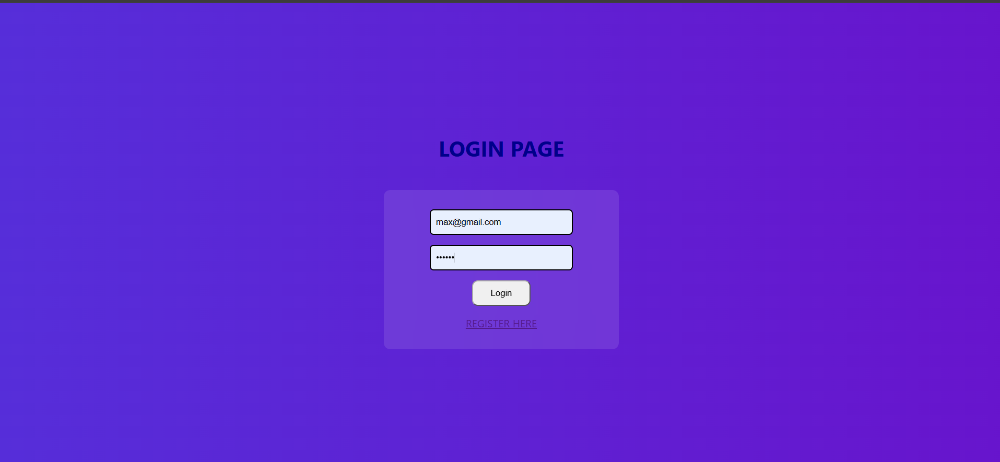
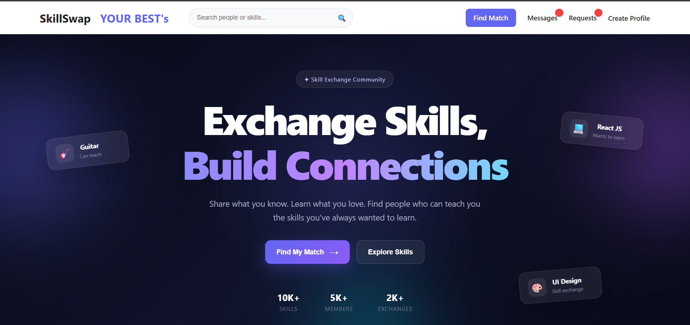
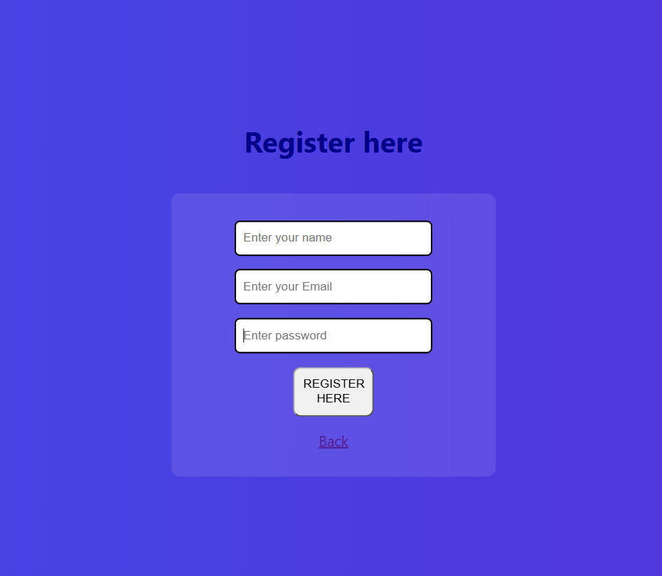
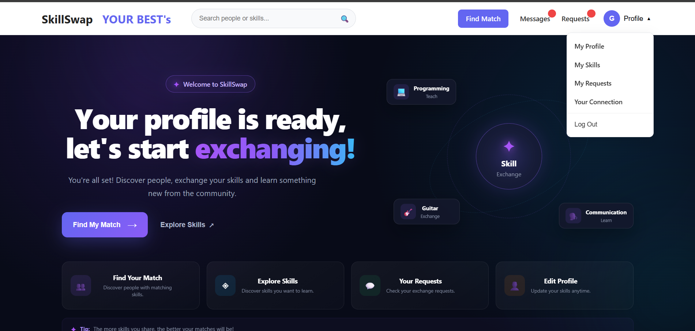
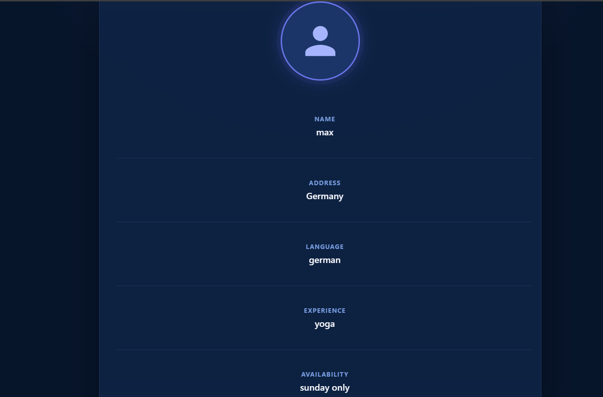
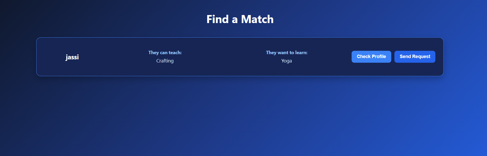
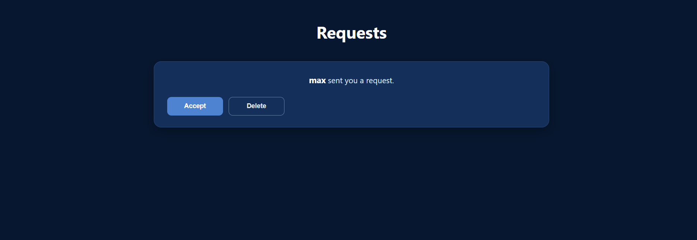
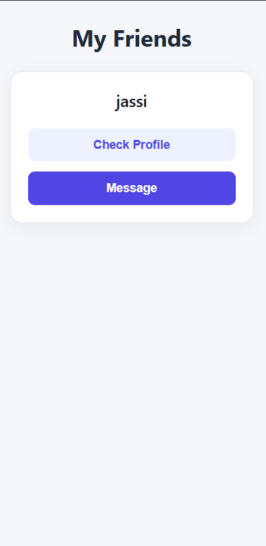
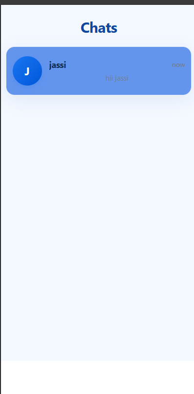
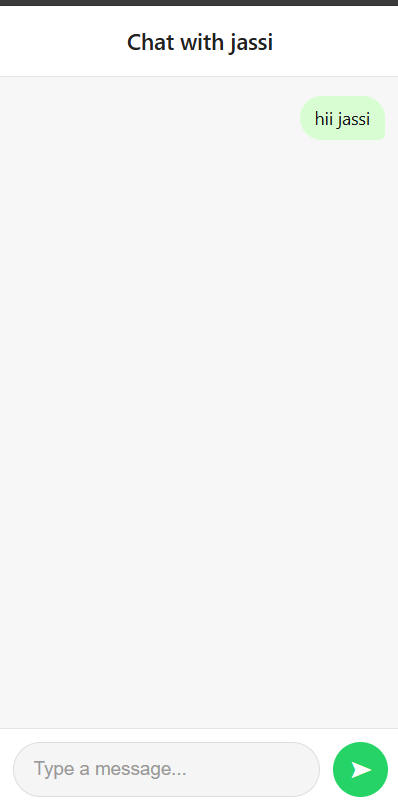

# SkillLoop

### Learn. Teach. Connect. Repeat.

SkillSwap YOUR BEST's is a modern skill-exchange platform where users can share the skills they know and discover people who can teach them new skills.

Instead of paying for every skill, users can connect with others and exchange knowledge based on what they can teach and what they want to learn.


---

## About The Project

SkillLoop is designed as a community-driven platform for learning and teaching.

A user can:

- Create an account
- Login securely
- Create their personal profile
- Add skills they can teach
- Add skills they want to learn
- View their profile
- View their skills
- Discover potential skill exchanges
- Send and receive skill-exchange requests

The main idea is simple:

> You teach what you know and learn what you want.

---

## ✨ Features

### 🔐 Authentication

- User registration
- User login
- Password encryption
- JWT-based authentication
- Protected API routes
- Token-based user identification

<table>
  <tr>
    <td align="center"><b>Login Page</b><br></td>
    <td align="center"><b>Register Page</b><br></td>
  </tr>
</table>

### 👤 User Profile

Users can create their own profile with:

- Name
- Profile photo
- Address
- Language
- Experience
- Availability

Users can view their submitted profile in a clean profile section.



### 🧠 Skill Management

Users can add two types of skills:

**Skills I Can Teach**

Skills that the user already knows and is willing to teach.

**Skills I Want To Learn**

Skills that the user wants to learn from other members.

The application uses skill suggestions to make selecting skills easier.



### 🔎 Skill Matching

SkillLoop is designed around matching users based on their teaching and learning skills.

For example:

```text
User A
Can teach: React
Wants to learn: Guitar

        ↕ Skill Exchange

User B
Can teach: Guitar
Wants to learn: React
```

Once your profile is set up, your personalized dashboard shows your skills and lets you find matches, explore skills, and manage requests.



### 🤝 Find a Match & Requests

Search for members whose "can teach" and "want to learn" skills complement yours, check their profile, and send a skill-exchange request.



Incoming requests can be accepted or declined from the Requests page.



### 👥 Friends

Once a request is accepted, the other user is added to your friends list, where you can check their profile or message them directly.



### 💬 Real-Time Chat

Chat with your connections directly inside the app.

<table>
  <tr>
    <td align="center"><b>Chats List</b><br></td>
    <td align="center"><b>Chat Window</b><br></td>
  </tr>
</table>

---

## 📸 Screenshots

| Login | Register | Landing |
|---|---|---|
|  |  |  |

| Exchange Skills | Dashboard | Profile |
|---|---|---|
|  |  |  |

| Find a Match | Requests | Friends |
|---|---|---|
|  |  |  |

| Chats List | Chat Window |
|---|---|
|  |  |
